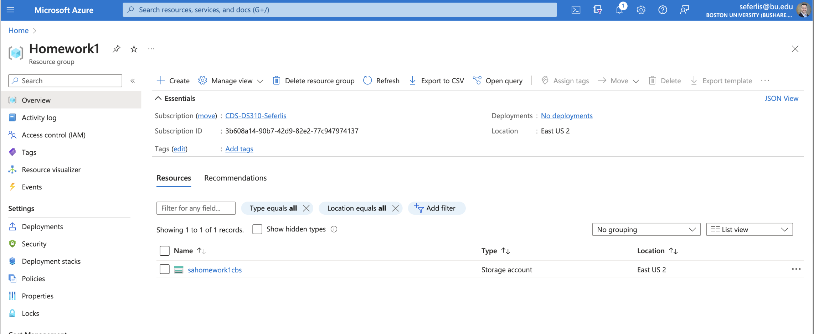

# Homework 1a: Preparing your Azure Environment

The National Highway Traffic Safety Administration (NHTSA) is a U.S. government agency committed to ensuring safety on America’s roads. By enforcing vehicle performance standards and collaborating with state and local governments, NHTSA works to reduce fatalities, injuries, and economic losses caused by motor vehicle crashes. Dedicated to the highest standards of excellence in motor vehicle and highway safety, the agency focuses daily on preventing crashes and minimizing their human and financial tolls. Guided by its core values of Integrity, Service, and Leadership, NHTSA strives to exceed public expectations and enhance roadway safety nationwide. Homework 1 and 3 will use the "Complaints" dataset from NHTSA that is a public record of all registered complaints about various automobiles over the years. The data is collected via web interface and phone calls, so the data itself can have some challenges with integrity and consistency, which you'll get to experience first hand!

Welcome to Homework 1! This cumulative assignment (Homework 1a-1c) will take you through the Extract, Load, and Transform (ELT) process which will be covered through the digital media and readings. It is highly recommeded to read and follow each assignment thoroughly, as well as review any additional tutorials or documentation to help with gaining perspective and skills on how to use the tools introduced in these and future assignments. 

This Homework 1a assignment introduces you to the Microsoft Azure platform, where you’ll set up your student account, create a resource group, and establish a storage account that will serve as a foundational element for upcoming assignments. You will be able to access the video posted to Blackboard for a video I recorded providing a high-level overview.

> For this course, you will use the “Azure for Students” offer provided by Microsoft. This offer allows for a $100 credit that can be replenished once a year as long as a student email address is being used. You will be expected to manage your budget. By adhering closely to the instructions outlined in the homework assignments, you will remain within the $100 credit limit. However, any expenses incurred beyond this allocation will be your responsibility.

## Overview
In this assignment, you will:
1. Set up a Microsoft Azure student account.
2. Create a resource group in Azure.
3. Create a storage account within your resource group, which we’ll use for future data storage needs.

Please follow the steps carefully and use the provided links for guidance on each section.

---

## Instructions

### Step 1: Create a Student Account in Azure if you haven't done so already

To access Azure resources, you’ll need to set up a Microsoft Azure student account. This will give you free access to essential Azure services, which you’ll use throughout the course.

1. Visit the [Azure for Students page](https://azure.microsoft.com/en-us/free/students/).
2. Click on **Activate Now** or **Start Free**.
3. Register using your `@bu.edu` email address to ensure you receive student benefits.
4. Complete the registration process as prompted on the Azure website.

**Note**: If you experience any issues during sign-up, refer to the FAQ section on the Azure page for troubleshooting tips.

### Step 2: Create a Resource Group

Azure Resource Groups allow you to organize and manage resources like virtual machines, databases, and storage accounts. For this assignment, you’ll create a new resource group that will contain all related resources.

1. Log in to your Azure student account.
2. Go to the [Azure Portal](https://portal.azure.com/).
3. Follow this guide to create a new resource group: [How to Create an Azure Resource Group](https://www.educative.io/answers/how-to-create-an-azure-resource-group-from-the-azure-portal).

### Resource Group Requirements:
- **Name**: Choose a meaningful name, like `Mod4_Homework` or something else you feel is appropriate that will help identify what the RG is for when traversing the Azure Portal.
- **Region**: Select a region close to you or one recommended by Azure. By default, most resources following this assignment will be deployed via template based on the region you choose for your Resource Group. If you have to cross regions with data, there can be additional charges for data egress, and there could be additional latency. 

### Step 3: Create a Storage Account

The storage account will be used for data storage in future assignments, serving as a data lake to manage and analyze data.

1. In the Azure Portal, navigate to the **Resource Group** you just created.
2. Use this article to guide you in creating a storage account within your resource group: [Create an Azure Storage Account](https://learn.microsoft.com/en-us/azure/storage/common/storage-account-create?tabs=azure-portal).

### Storage Account Requirements:
- **Name**: Choose a unique name for your storage account, such as `StudentDataStorage`.
- **Region**: Select the same region as your resource group. **Note: You will want to have all of your resources (services) deployed in the same reason whenever possible as this will save Data Egress costs.
- **Performance**: Choose **Standard**.
- **Replication**: Select **Locally-redundant storage (LRS)**, which is sufficient for this course.

### Step 4: Create a Storage Container

1. In the Azure Portal, navigate to the **Storage Account** you just created.
2. Use this article to guide you in creating a storage container within your storage account: [Create an Azure Storage Container](https://learn.microsoft.com/en-us/azure/storage/blobs/storage-quickstart-blobs-portal#create-a-container).

---

## Submission

> Submit the following as proof of your work:

**IMPORTANT:** Ensure your BU account information is visible in the top right corner of your screenshots for verification.

1. **Screenshot of the Storage Account** within the resource group.
   - 

If you screen matches closely, understanding names may be different, and your user id in the top right corner of the portal instead of what's shown, you have completed HW1a, congrats!

In the next section, you will be Extracting the Complaints data from the NHTSA website and extracting the .zip file as a .txt file to prepare for completing the full assignment.

---

## Some Helpful Tips

- Azure’s interface may change over time. If something doesn’t look exactly like the guides, look for similar options or refer to Azure’s documentation. Also, if you could, please let the Learning Facilitators know of changes so they are able to adapt them to the homework assignments.
- Keep track of the names you give your resources, as you’ll need them for future assignments.
- Azure provides $100 in free credits with your student account—be mindful of your usage to stay within this limit.

---

Enjoy exploring Azure, and happy learning!
