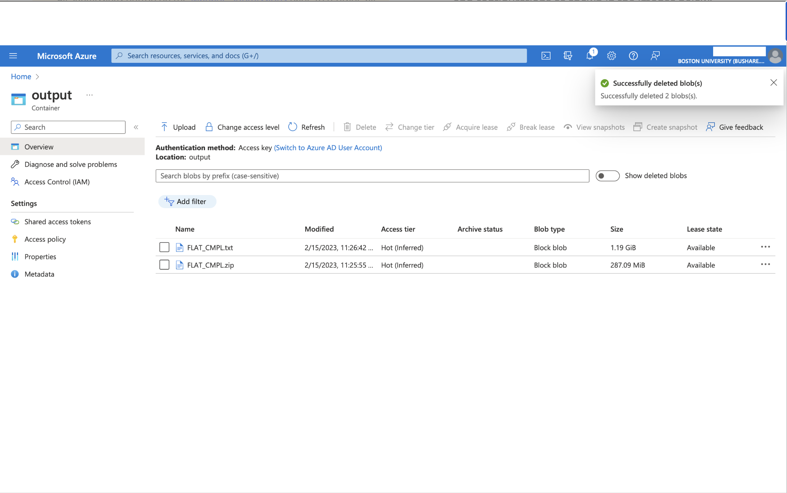
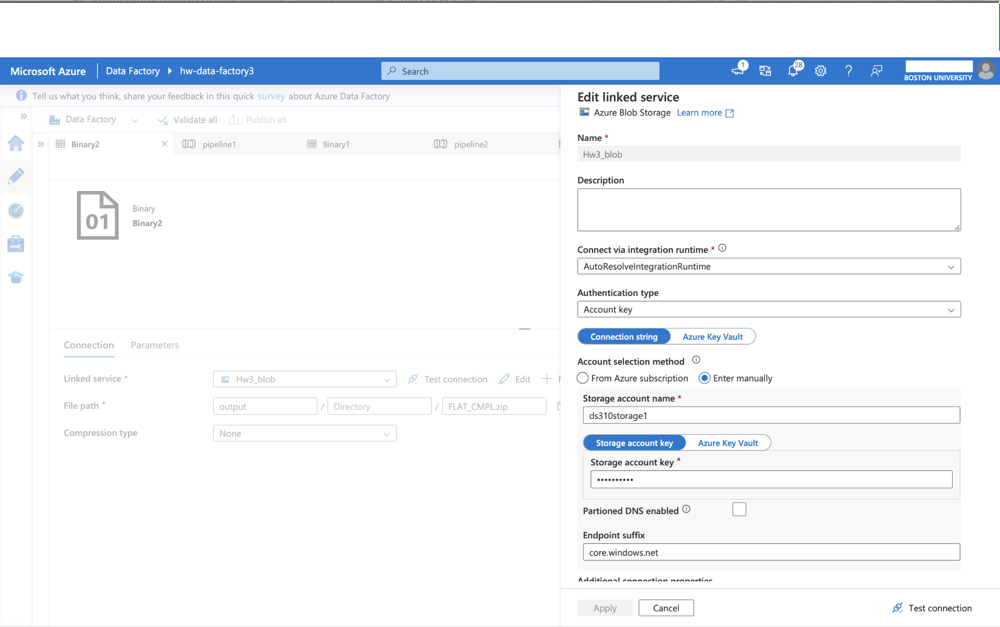

# Homework 1b - Extract & Load

In Homework 1a you developed your baseline for your Azure environment, Resource Group for logical service groupings, and a storage account for storing and working with your data. Now you will begin the process of manipulating data by downloading the dataset we will work with for the majority of your homework assignments throughout the semester. From there, you'll extract the file to the same folder you've downloaded to stage the data for completing Homework 1c and the overall graded assignment. So, without further ado...

**Let the games begin!**

This homework assignment requires thoughtful planning and execution, so avoid procrastination. If you aspire to a tech career, this should be an enjoyable challenge—much more engaging than American Literature or Sociology!

## Assignment Overview
For this assignment, you will be working with the National Highway Traffic Safety Administration (NHTSA) "Complaints" data. Your goal is to extract, load, and prepare this data using Azure Data Factory (ADF). You will:

1. **Extract**: Download the data file from the provided NHTSA link.
2. **Load**: Transfer the file to a newly created Azure Storage account (blob type) using Azure Data Factory.
3. **Unzip**: Extract the file contents into a `.txt` file using ADF.

> **Important**: All steps must be completed using Azure Data Factory tools—manual operations are not allowed.

> For this course, you will use the “Azure for Students” offer provided by Microsoft. This offer allows for a $100 credit that can be replenished once a year as long as a student email address is being used. You will be expected to manage your budget. By adhering closely to the instructions outlined in the homework assignments, you will remain within the $100 credit limit. However, any expenses incurred beyond this allocation will be your responsibility.

> **Hint** Download the Homework1b.pdf file from the ‘Extract And Load’ folder in this repository and review its contents.

## Instructions

### Step-by-Step Guide
1. **Set Up Azure Data Factory**:
   - Ensure that you have created your Azure account and storage account in order to create an Azure Data Factory instance.
   - You should use the `bash formTemplate.sh` script from the [top-level ReadMe.md file](https://github.com/cseferlis/OMDSMod4/blob/main/README.md) for creating your Data Factory, using the following command to deploy resources, remembering to replace your resource group, template and parameter details as with Homework 1b:

   ```azurecli-interactive
   az deployment group create --resource-group <resource-group-name> --template-file <path-to-template.json> --parameters @<path-to-parameters.json>
   ```
   
   - Follow this guide to learn about Azure Data Factory: [Getting Started with Azure Data Factory](https://learn.microsoft.com/en-us/azure/data-factory/quickstart-create-data-factory)

3. **Extract the Data**:
   - Use Azure Data Factory to create a pipeline that extracts the data from the `Complaints` data source.
   - The data is available at the following link: [Complaints Data File](https://static.nhtsa.gov/odi/ffdd/cmpl/FLAT_CMPL.zip)
   - Hint: Treat the data source as an HTTPS-linked dataset within ADF. [HTTP endpoint in Data Factory](https://learn.microsoft.com/en-us/azure/data-factory/connector-http?tabs=data-factory)

4. **Load the Data**:
   - Use ADF's copy activity to transfer the `.zip` file from the HTTPS source to your Azure Storage container created in Homework 1a with Blob Storage enabled.
   - Reference: [How to Create a Storage Account](https://learn.microsoft.com/en-us/azure/storage/common/storage-account-create?tabs=azure-portal)

5. **Unzip the File**:
   - Use another ADF's copy activity to unzip the file within the pipeline. Ensure that the extracted content is in `.txt` format and stored in your Azure Storage account.
   - Follow tutorials and documentation from Microsoft for guidance on data transformation and extraction. You can start with this [Quickstart](https://learn.microsoft.com/en-us/azure/data-factory/quickstart-hello-world-copy-data-tool)

## Reference Files and Tutorials

### Source data file information

As discussed, we will be using Complaints Data from NHTSA for the majority of the assignments in this module. Please closely review the folling resources to ensure you have a good grasp of the data we will be using, and pay special attention to Appendix A of the Complaints Reference File as this will help you define your schema for staging your data going into Homework 1c. You **may** follow the steps for working with the data in Excel preceeding the schema reference, however, it will only help you understand working with the data but will not help you with this assignment. 

- **NHTSA Complaints Data Information**: [Complaints Information](https://www.nhtsa.gov/nhtsa-datasets-and-apis#complaints)
- **Complaints Reference File**: [Reference Document](https://static.nhtsa.gov/odi/ffdd/cmpl/Import_Instructions_Excel_All.pdf)

## Using Deployment Template
For any resource deployment, use the following command. Replace placeholders with your specific resource group and file paths as discussed in the [Top-Level Readme File. ](https://github.com/cseferlis/OMDSMod4/blob/main/README.md) Be sure to Navigate to your specific homework folder, in this case "Homework 1b" and the folder containing the "formTemplate.sh" file to ensure proper deployment of resources.

```azurecli-interactive
az deployment group create --resource-group <resource-group-name> --template-file <path-to-template.json> --parameters @<path-to-parameters.json>
```

---

## Expectation

> Upon completion, your output should look like the following image.

1. **Screenshot of the data file extracted in the storage account** 
   - 

2. **Screenshot of the Azure Blob Storage Linked Service**
   - 

3. **Screenshot of the HTTP Linked Service**
   - 

---

### Key Points to Consider 🤔
- How will you handle the HTTPS source in your pipeline?
- What is the best approach to ensure the `.zip` file is unzipped automatically within ADF?
- How will you verify the integrity and structure of the `.txt` file once it’s extracted?

Ensure you complete all steps and verify that your data has been properly extracted and loaded into your Azure Storage account. Reach out for assistance to your Learning Facilitator if needed, and don’t hesitate to explore additional resources and tutorials found through your search engine of choice.

Good luck, and enjoy the challenge!
