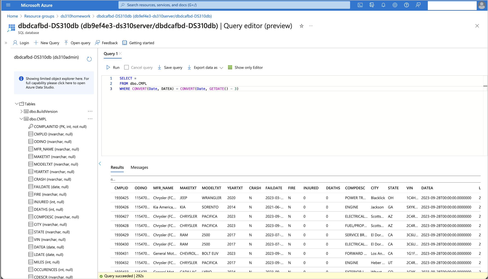

# Homework 1c - Transforming and Staging

**Class,**

In Homework 1a and 1b you created some of the Azure services being used for the semester assignments, then grabbed our source data from the NHTSA website, uzipped that data to a `.txt` file and placed the file in storage for further use. Now we culminate our first homework assignment, Homework 1c. Here we will take all the work done to date, and complete the assignment to be graded.

> **NOTE** - Homework 1c builds on your activities in Homework 1b (Extract and Load). You will be using the same `Resource Group` and `Data-Factory` from the previous assignment. If you could not complete Homework 1b due to difficulties, please reach out to your LF Office Hours for assistance before starting this assignment.

In Homework 1b, you extracted and loaded a data file into your storage account. For Homework 1c, you will extend that work by transforming and moving data from a `.txt` file into a SQL Server database table. Refer to the appendix of this [reference document](https://static.nhtsa.gov/odi/ffdd/cmpl/Import_Instructions_Excel_All.pdf) for details on datatypes and fields.

## Assignment Overview
Using your existing Data Factory, you will:

1. **Transform**: Convert the `DateA` column datatype from text to date.
2. **Stage**: Load the transformed data into a database table named `<initials>Complaints` within a SQL Server database.

> **Hint**: Download the Homework1c.pdf file from the ‘Transforming and Staging’ folder in this repository and review its contents.

## Steps to Complete Homework 1c

> For this course, you will use the “Azure for Students” offer provided by Microsoft. This offer allows for a $100 credit that can be replenished once a year as long as a student email address is being used. You will be expected to manage your budget. By adhering closely to the instructions outlined in the homework assignments, you will remain within the $100 credit limit. However, any expenses incurred beyond this allocation will be your responsibility.  

### Step 1: Set Up Your SQL Server and Database
Once again, you should use the `bash fromTemplate.sh` script from the [top-level ReadMe.md file](https://github.com/cseferlis/OMDSMod4/blob/main/README.md) for creating your SQL Server, using the following command to deploy resources, remembering to replace your resource group, template and parameter details as with Homework 1c:

```azurecli-interactive
az deployment group create --resource-group <resource-group-name> --template-file <path-to-template.json> --parameters <path-to-parameters.json>
```

- SQL Database + Server Credentials:
   - Login: omdsmod4admin
   - Password: omdsmod4password013!

**Troubleshooting SQL Database & Server Deployment**
   - If you encounter an error related to region or location, you may need to manually create the SQL Database and Server. Follow these steps to ensure proper setup with minimal cost:
   
	1. **Resource Group**:
      - Use the Resource Group you created for Homework 1a.
      
	2. **Database**:
      - Set name as `<initials>mod4db`.
      
	3. **Server**:
      - Set name as `<initials>mod4server`.
      - Choose the same Region as your Resource Group.
      - Enable both SQL and Microsoft Entra authentication. (You may choose your own)
        - **Login ID**: `omdsmod4admin`
        - **Password**: `omdsmod4password013!`
        - Add yourself as an admin.
        
	4. **Configuration Settings**:
      - **SQL Elastic Pool**: Do not enable.
      - **Workload Environment**: Select **“Development”**.
      - **Compute Tier**: Choose **“General Purpose - Serverless”**.
      - **Estimated Cost**: Approximately **$5/month**.
      - **Backup Storage Redundancy**: Select **“Locally Redundant Storage”**.
      
	5. Click **“Review + Create”** to finalize the setup.
   
	6. **Deployment**: The database creation may take **5-10 minutes**.
   
	7. **Post-Deployment Steps**:
      - Go to **SQL Server** > **Security** > **Networking**.
      - **Allow Public Access**:
         - Under **Firewall rules**, click **“Add your client IPv4 address”**.
         - Under **Exceptions**, check **“Allow Azure services and resources to access this server”**.

### Step 2: Create Your Database Table
Use the `Complaints Reference File` to set up your table attributes with the correct data types. It is recommended to use `NVARCHAR` for text columns to handle Unicode characters. The reference file specifies the lengths of each of the attributes (columns) when defining your database table.

### Step 3: Load Data with Azure Data Factory
1. Use Azure Data Factory to create a pipeline that includes:
   - **Transformation**: Convert the `DateA` column from text to a date (not datetime) format.
   - **Loading**: Insert the data into the `<initials>Complaints` table.

### Step 4: Query and Export Results
After loading the data, run the following query in your SQL Server, making sure to replace the table name with the name you created for your table in your database:

```sql
SELECT *
FROM <cbsComplaints>
WHERE DATEA = CONVERT(Date, GETDATE() - 1)
```

> **Note**: The "GETDATE() - 1" is a SQL command specifying Today's date -1 day, aka yesterday. However, if your latest file download is prior to today, or happens to fall on a weekend, you will have to change the "-1" to the most recent day where records exist in the source dataset. (-2, -5, -7, etc for the number of days back)

Output the results to a file and save it as a PDF for submission.

## Reference Documents and Tools
- [Getting Started with Azure Data Factory](https://learn.microsoft.com/en-us/azure/data-factory/quickstart-create-data-factory)
- [Creating a Storage Account](https://learn.microsoft.com/en-us/azure/storage/common/storage-account-create?tabs=azure-portal)
- [Creating a Database in Azure SQL Server Using Your Existing SQL Server](https://learn.microsoft.com/en-us/azure/azure-sql/database/single-database-create-quickstart?view=azuresql&tabs=azure-portal)
- [Creating a Table in an Azure SQL Database](https://www.edureka.co/community/62364/how-to-create-table-in-azure-sql-database)
- [Complaints Data File](https://static.nhtsa.gov/odi/ffdd/cmpl/FLAT_CMPL.zip)
- [Complaints Reference File](https://static.nhtsa.gov/odi/ffdd/cmpl/Import_Instructions_Excel_All.pdf)
- [Copy Tool](https://docs.microsoft.com/en-us/azure/data-factory/copy-activity-overview)
- [Data Flow](https://docs.microsoft.com/en-us/azure/data-factory/concepts-data-flow-overview)

---

## Submission

> Submit the following as proof of your work:

**IMPORTANT:** Ensure your BU account information is visible in the top right corner of your screenshots for verification.

1. **Screenshot of Query Execution in Azure SQL Database** 
   - 

2. **PDF or CSV File of the SQL Query Output**

Typically you can expect approximately a couple hundred records added per day, so if you are getting more, check your query, else, if you have zero, you may need to go back further with your GETDATE command.

Save the screenshots as `.png` or `.jpg` files and upload them through the course submission portal for Homework 1c. For a further explanation on how to submit your assignment on Gradescope, refer to the Blackboard page or request support from your Learning Facilitator.

---

## Points to Consider 🤔
- How do you use the `Complaints Reference File` to create a table in Azure SQL Database?
- How do you use the `Copy Tool` to load data from Azure Storage to Azure SQL Database?
- How do you handle rows with missing values?
- What happens if the data in the txt file does not adhere to the datatype you've set for your SQL database table?
- What if the header column names differ from table column names?
- What is the current format of the file, the delimiter, and the number of columns?
- How do you map columns and change their data types?

---

Ensure you understand each step and reach out with any questions!
