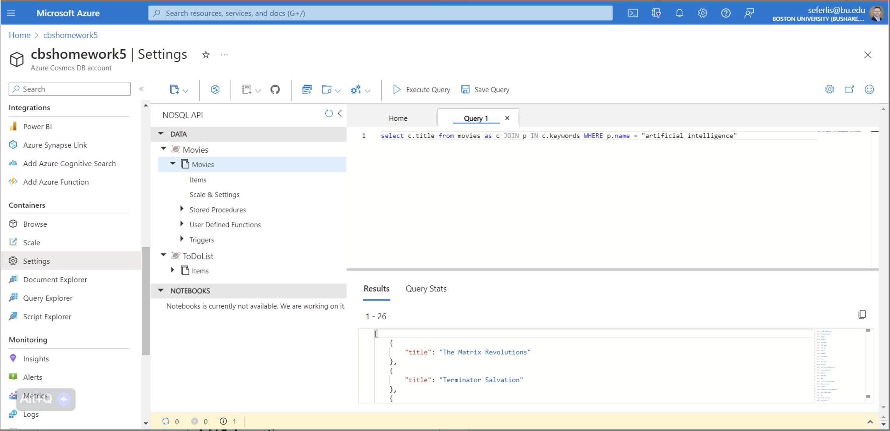

# Homework 2 - NoSQL

**Class,**

> **NOTE** - Homework 2 builds on the work done in Homework 1(a-c). You will use the same `resource group` and `data-factory` created in previous assignments. If you could not complete those assignments, please reach out to an LF for assistance. Create a new pipeline specifically for HW2.

## Introduction
We are now shifting our focus to NoSQL databases and working with Microsoft's powerful, globally distributed, multi-modal database, CosmosDB. This flexible DBMS supports various data models, including SQL, Graph, and Document databases, and provides sub-10ms replication to nodes worldwide. Its impressive speed powers services such as the Xbox Gaming network.

Read more about CosmosDB and its capabilities [here](https://learn.microsoft.com/en-us/azure/cosmos-db/introduction).

## Assignment Overview
Building on Homework 1, where you extracted and loaded data into your Azure storage account, you will now work with a NoSQL database to load and manipulate complex data structures with nested attributes.

For this assignment, you will use the TMDB dataset for 5000 movies. The cleaned version of this dataset is hosted [here](https://mod4.blob.core.windows.net/hw2/tmdb_5000_movies.json).

### Steps to Complete Homework 2

1. **Set Up Azure CosmosDB**:
   - Follow this [tutorial](https://learn.microsoft.com/en-us/azure/cosmos-db/nosql/quickstart-portal) to learn how to deploy a CosmosDB instance.
     
   - To deploy resources run the template from the repository using the following command from the Azure CLI, remembering to replace the resource group, template and parameters for your environment:
     ```sh
     bash ./formTemplate.sh
     ```
     ```sh
     az deployment group create --resource-group <resource-group-name> --template-file <path-to-template.json> --parameters <path-to-parameters.json>
     ```

2. **Create the Database and Container**:
   - **Database ID**: `omdsmod4`
   - **Container ID**: `movies`
   - **Partition Key**: Use `status` as the partition key.
   - **Throughput**: Set to Manual and configure at 400 RU/s or whatever the "Free" tier is. 
   > **Note:** you may have to play with the configuration of Manual and Auto Scaling to get the appropriate free tier of the database. make sure to use caution when setting the R/U Compute as an incorrect setting can cause cost overruns, expending your free credits.

3. **Extract Data Using Azure Data Factory (ADF)**:
   - Create a new ADF pipeline to grab the JSON file from the provided link: [TMDB Dataset](https://mod4.blob.core.windows.net/hw2/tmdb_5000_movies.json).

4. **Load the Data**:
   - Use ADF's copy tool to load the JSON data from the online link into the `movies` container in CosmosDB.
   - Ensure the appropriate dataset format for JSON files is used in ADF.

5. **Query the Data**:
   - Run sample SQL queries to interact with your data using this [tutorial](https://learn.microsoft.com/en-us/azure/cosmos-db/nosql/tutorial-query).
   - Execute the following query:
     ```sql
     SELECT c.title 
     FROM movies AS c 
     JOIN p IN c.keywords 
     WHERE p.name = "artificial intelligence"
     ```
   - This should return 26 movie titles tagged with "artificial intelligence." If your result matches, your work is correct.

6. **Modify and Run an Additional Query**:
   - Now take what you have learned to modify the above query to find movies produced by the **"Dentsu"** production company starting with the query structure below. There should be 12 records returned as referenced in the image required for submission:
     ```sql
     SELECT c.title 
     FROM movies AS c 
     JOIN 
     WHERE 
     ```
   - Capture a screenshot of the output for both queries, ensuring your Azure account is visible in the top right corner of the window.

      - **Important**: Do not clean up resources in the final step—the database should remain active.
---

## Submission

> Submit the following as proof of your work:

**IMPORTANT:** Ensure your BU account information is visible in the top right corner of your screenshots for verification.

1. **Two Screenshots of the Following Query Execution** 
   - 

   - 

Save the screenshots as `.png` or `.jpg` files and upload them through the course submission portal for Homework 2.

---

## Points to Consider 🤔
- Ensure you choose the correct dataset format in ADF for JSON data.
- Understand how to use the `Copy Tool` for loading data from an external source into CosmosDB.
- Explore how you can map data properties, such as `production_companies`, in your queries to accurately retrieve information.

## Additional Tips
- Take your time to verify that your data has been successfully loaded and that your database structure matches the expected configuration.
- Use Yellowdig and BU Virtual Campus for questions and collaborate with classmates to troubleshoot and share solutions.

Good luck, and enjoy working with CosmosDB!
