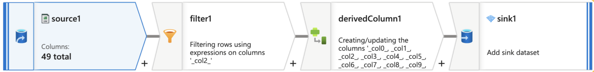
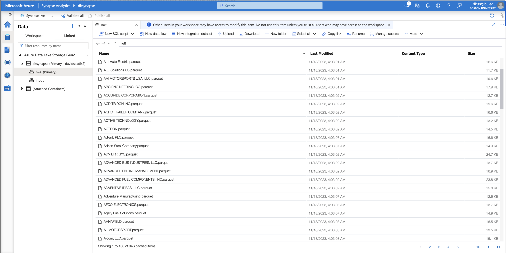
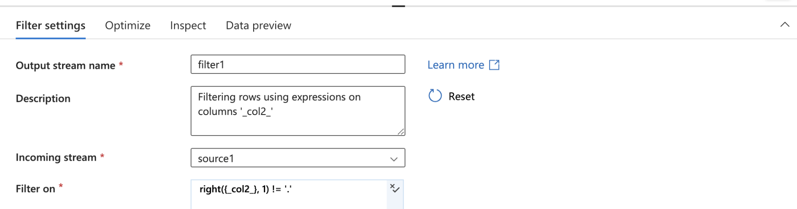
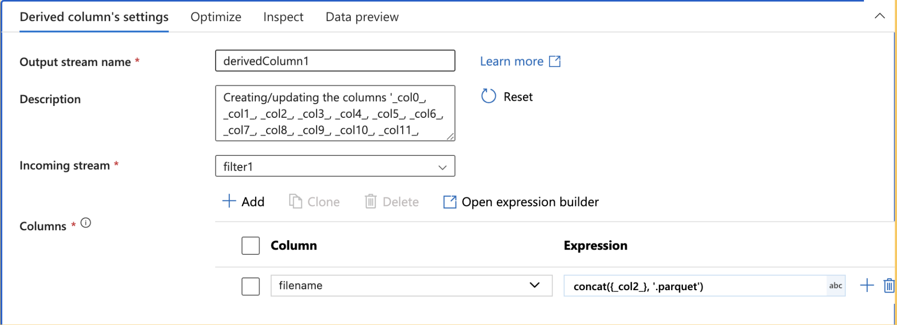
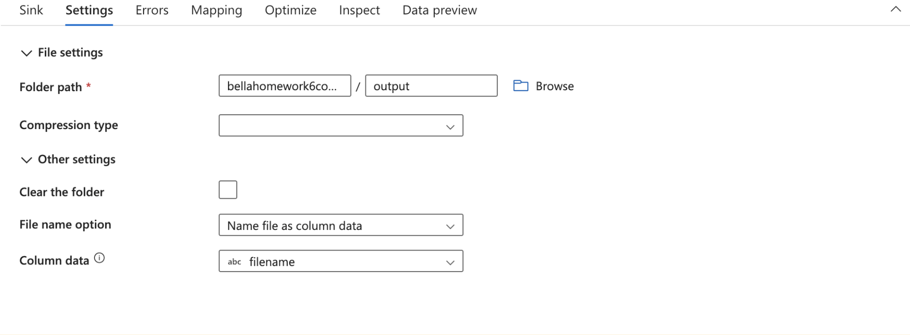

# Homework 3a: Azure Synapse Workspace and Parquet Files Creation

## Objective

In this assignment, we are getting back to our NHTSA data where you will begin working with Azure Synapse Analytics and utilize its SQL Serverless pools powered by a Massively Parallel Processing (MPP) engine. Your task is to prepare your data by converting the NHTSA Complaints File into a `.parquet` format suitable for distributed systems and datasets (sharding). This process simulates the preparation needed to connect to data using Polybase and read directly from the Data Lake. In **Homework 3b**, you will connect to this data as an external table. The main objective of this assignment is to create an **Azure Synapse Workspace** and partition `.parquet` files by manufacturer name.

## Tasks

---

### 1. Upgrade Your Storage Account

To link your **Synapse Workspace** to a storage account, it may need to be **upgraded to Azure Data Lake Storage (ADLS) Gen 2** if it wasn't set up during the initial deployment. If your storage account is not already upgraded, follow these steps:

1. **Navigate to your Storage Account** in the Azure Portal.
2. In the **left-hand menu**, go to **Settings** > **Data Lake Gen2 upgrade**.
3. Click **Review and agree to changes** to proceed with the upgrade.
4. **Validate your account** to check for any features that may not be supported.
5. Once validation is complete, **start the upgrade** process.
6. After the upgrade, confirm that **Hierarchical Namespace** is enabled under **Configuration**.

---

### 2. Convert the NHTSA TXT File to Parquet Format

Use **Azure Data Factory (ADF) Data Flows** to perform the following steps:

- Hint:
- 

1. **Set Up a Data Flow**:
   - Configure the NHTSA TXT file from Homework 1b as the data source.

2. **Configure the Sink**:
   - The output format must be `.parquet`.
   - Go to the 'Mapping' section under the sink settings and update the output column names accordingly.
      - Ensure that the column names match those specified in the [Complaints Reference File](https://static.nhtsa.gov/odi/ffdd/cmpl/Import_Instructions_Excel_All.pdf)

3. **Partition the Parquet Files**:
   - Partition the `.parquet` files by the manufacturer name.
   - Some manufacturer names end with a dot (.), this is not allowed in your storage accounts, use filters to filter them out using filter operator in data flow.
   - Refer to the [Complaints Reference File](https://static.nhtsa.gov/odi/ffdd/cmpl/Import_Instructions_Excel_All.pdf) for field details.

---

### 3. Create Your Synapse Workspace

Set up your **Azure Synapse Workspace** by following these steps:

1. **Create the Synapse Workspace**:
   - Refer to this [tutorial](https://learn.microsoft.com/en-us/azure/synapse-analytics/get-started-create-workspace) for detailed instructions.
   - **Note**: Do not use the sample data provided in the tutorial.

2. **Link Your Storage Account**:
   - In the Data section of the Synapse Workspace, add your storage account as a linked service if not already connected.
   - Ensure the primary storage account is correctly set up as ADLS Gen 2.

---

### 4. Verify the Created Parquet File

Ensure the `.parquet` files created from the NHTSA data are **accessible in your Synapse Workspace**. This will be essential for the **subsequent homework**.

---

## Expected Output

> Upon completion, your output should look like the following image:

1. **Storage Container View on Synapse Workspace**:
   - 

---

## 🔍 Troubleshooting

If you run into issues while completing the assignment, consider these common **troubleshooting steps**:

### 1. **ADLS Gen2 Upgrade Errors**
- **Issue:** Getting an error related to `containerDeleteRetentionPolicy` when validating the upgrade.  
- **Fix:**  
  - Navigate to **Data management** > **Data protection** in your storage account.
  - Disable the **Container delete retention policy**.
  - Save the changes and retry the validation process.

### 2. **Setting Up Filter**
- **Issue:** If the name in **Manufacturer Name** ends with a period (.), it may cause an error.
- **Fix:**  
  - Use a **filter transformation** in Azure Data Factory (ADF) to remove these rows:
    ```
    right({column_name}, 1) != '.'
    # column_name must be edited with the proper column name
    ```
    or
    ```
    !endsWith({column_name}, ".")
    # column_name must be edited with the proper column name
    ```
  - 

### 3. **Setting Up Derived Columns**
- **Issue:** Parquet files are missing `.parquet` extension in their filenames.
- **Fix:**  
  - Use a **Derived Column** transformation in ADF to append `.parquet` to each filename:
    ```
    concat({column_name}, '.parquet')
    # column_name must be edited with the proper column name
    ```
  - 

### 4. **Setting Up Partitioning**
- **Issue:** Partitioning based on column data is not working.
- **Fix:**  
  - Set **"Source" to "Single Partition"** in the **Optimize settings**.
  - There are **two partitioning options** for sink in Azure Data Factory:
    - **File Name as Column Data** → **Files** named after the **Manufacturer**. → **This is Correct**
    - **Set Partitioning - Key** → **Folders** named after the **Manufacturer**. → This is Incorrect
  - 

### 5. **Synapse Storage Link Issues**
- **Issue:** Parquet files are **not appearing** in **Synapse Analytics**.
- **Fix:**  
  - Ensure your **Storage Account is correctly linked** in **Azure Synapse Analytics**.
  - Navigate to **Data** → **Linked Services** → Click **"+"** → **"Connect to external data"** → Select your **Storage Account**.

---

## 📚 Additional Resources
- [Tutorial: Write to a Data Lake](https://learn.microsoft.com/en-us/azure/data-factory/tutorial-data-flow-write-to-lake)
- More about [Polybase (Data Virtualization)](https://learn.microsoft.com/en-us/sql/relational-databases/polybase/polybase-guide?view=sql-server-ver16)
- More about [Parquet Files](https://www.databricks.com/glossary/what-is-parquet)

Ensure all steps are completed accurately and verify that the `.parquet` files are correctly partitioned and accessible from your Synapse Workspace. Reach out to your **LF (Learning Facilitator)** if you have any questions or need further assistance.
