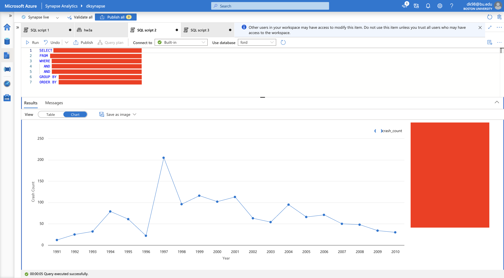

# Homework 3b: Synapse SQL Script, External Table Creation, and Data Visualization

In Homework 3b, you will connect to the `.parquet` file created in Homework 3a, mount it as an external table in your Azure Synapse Serverless Pool, and in Homework 3c visualize the data using PowerBI. This assignment will require setting up proper permissions for your Azure Storage account, ensuring the correct configuration of your `.parquet` file, and running queries to produce a visual representation of the data. In Homework 3c, you will then connect to your Synapse environment from PowerBI and visualize the data you've been working with.

## Objective
Create an external table in Azure Synapse, use Synapse SQL scripts to read `.parquet` files, and visualize the queried data.

## Tasks

---

### 1. Set Up ACL Permissions and Synapse Administration

- **Set Access Control List (ACL) Permissions** (Azure Data Lake Storage Gen2):
  - Navigate to your storage container in Azure.
  - Right-click your data folder and select **Manage ACL**.
  - Check that **Read, Write, and Execute** permissions are granted to your account.
  - Reference: [Azure ACL Documentation](https://learn.microsoft.com/en-us/azure/storage/blobs/data-lake-storage-acl-azure-portal).

- **Assign Synapse Administrator Permissions**:
  - Open Azure Synapse Studio → **Manage → Access Control**.
  - Assign yourself the **Synapse Administrator** role.

> **⚠️ Note:** Permissions might already be configured. Double-check before modifying.

---

### 2. Create an External Table

  - **Step 1: Locate the Ford Parquet File**
    - Open **Azure Synapse Studio**.
    - Navigate to the **Data** tab on the left-hand panel.
    - Locate the file named `'Ford Motor Company.parquet'`.
    - Right-click the dataset and select **Create External Table**.
  
  - **Step 2: Configure External Table Settings**
    - Use the [Azure Synapse External Table Documentation](https://learn.microsoft.com/en-us/azure/synapse-analytics/sql/develop-tables-external-tables?tabs=hadoop) as a reference if needed.
    - Ensure the external table schema accurately matches the structure of your `.parquet` file to avoid schema mismatch errors.
  
  - **Step 3: Define Database and External Table**
    - Provide a clear and descriptive name for your database.
    - Assign a meaningful name for your external table (e.g., `FordExternalTable`).
  
  - **Step 4: SQL Script Adjustments**
    - When prompted, choose the option **Using SQL Script** for creating the external table.
    - Make sure the auto-generated `CREATE EXTERNAL TABLE` SQL script is as you want it.
  
  - **Step 5: Execute and Validate**
    - After editing the script, click **Run**.
    - Wait until the query execution completes successfully.
    - Refresh your workspace view to verify:
      - The newly created **database** appears.
      - The external table you defined is listed within that database.
  
  - You're now ready to query your external table!

---

### 3. Data Analysis (SQL Query Instructions)

  - Write a new SQL query to extract **crash data specifically for Ford F-150 manufactured between 1990–2010**:

    #### 🔹 Query Requirements:
    - **Car Model:** 'F-150'
    - **Model Year:** Between '1990' and '2010'
    - **Crash Indicator:** Only crashes (`Crash = 'Y'`)
    - **Aggregate:** Count crashes per year
    - **Sort:** Ascending by year
   
  > **⚠️ Note:** Refer to the [Complaints Reference File](https://static.nhtsa.gov/odi/ffdd/cmpl/Import_Instructions_Excel_All.pdf) to find the correct columns.

  > If you encounter an “Invalid object name” error, verify you’re selecting the correct database from the Use database dropdown (do not use the default 'master').

---

### 4. Create a Data Visualization

  - **Generate a Plot**:
    - After running the query:
      - Click the Results tab.
      - Select Chart.
    - This can be a bar chart or line graph that displays the number of crashes by year.

---

## Expected Output

> Upon completion, your output should look like the following image:

1. **SQL Query and Plot in Azure Synapse**:
   - 
   - If not? Make sure to check in with the LFs for support.

Follow all steps thoroughly and reach out for support if needed. Good luck, and enjoy exploring data with Azure Synapse!
