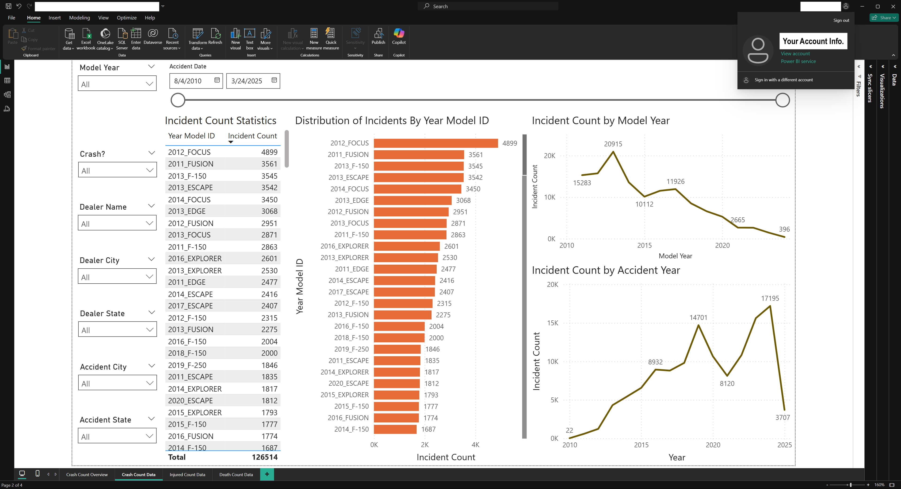
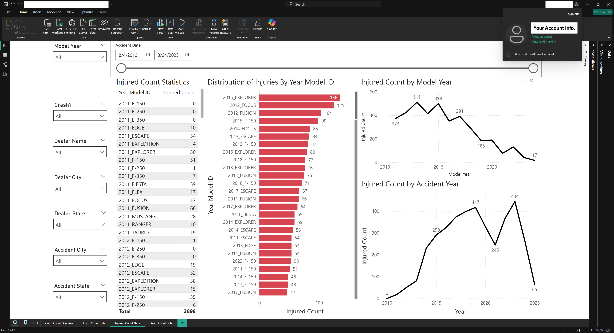
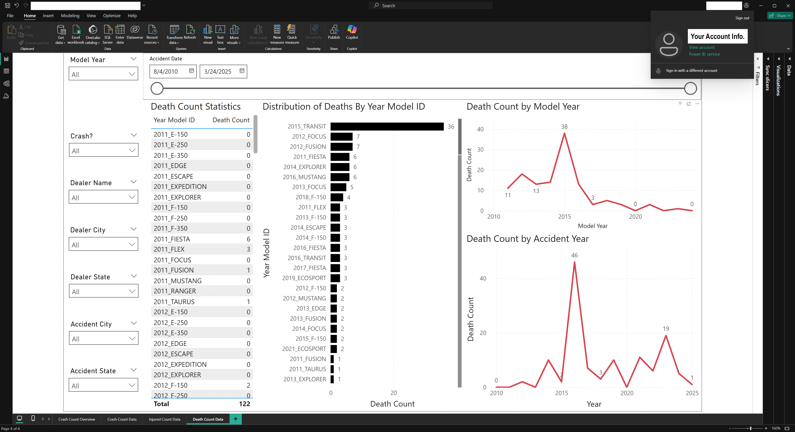

# Homework 3c: Microsoft Power BI

## Objective
The primary goal of this homework is to introduce you to **Microsoft Power BI**, focusing on its fundamental tools and techniques for data visualization. Upon completing this assignment, you'll have acquired essential data visualization skills, a core competency for every data analyst.
In Homework 3c, you'll connect Power BI to your Azure Synapse environment, enabling you to visualize the datasets previously explored in Homework 3a and 3b.

## Tasks

---

### 1. Accessing Power BI
#### Windows Users
  - Download and install **Power BI Desktop** on your local Windows machine:
    - [Download Power BI Desktop](https://powerbi.microsoft.com/en-us/desktop/)

#### Mac Users
  - Access Power BI via **Azure Virtual Desktop** using the **Windows App:**
    - Follow this guide to set up your virtual environment: [Azure Virtual Desktop Setup for macOS](https://learn.microsoft.com/en-us/windows-app/get-started-connect-devices-desktops-apps)
  
  - **Folder Redirection Setup**:
    - Configure **Folder Redirection** to access local Mac folders on your virtual machine:
      - [Folder Redirection Guide](https://bowdoin.teamdynamix.com/TDClient/1814/Portal/KB/ArticleDet?ID=132977)
    - Examples for Folder Redirection setup:
      - 
      - 

#### Optional
  - You’re welcome to use the online version of Power BI if you prefer: [Online Power BI](https://app.powerbi.com/)

---
---

### 2. Create a Power BI Report
Refer to the [Power BI Report Creation Tutorial](https://learn.microsoft.com/en-us/power-bi/create-reports/desktop-dimensional-model-report) if you need detailed guidance.

---

#### 📌 Step 1: Import Data from Azure Synapse
  - Open the Power BI app from your Virtual Desktop (Windows App).
  - Click **Get data from another source → Azure Synapse Analytics SQL**.
  - **Retrieve your Synapse Server Name**:
    - Navigate to your Azure Synapse workspace.
    - Copy the **Serverless SQL endpoint** address.
  - Paste this address into the **Server** field in Power BI.
  - Choose **Import** as your Data Connectivity Mode.
  - Log in using your Azure credentials via **Microsoft Account**.
  - Select and load the external table you created in Homework 3b.
  
  - **Transforming Data**:
    - Click on **Table View** (second icon from the top left).
    - Create a **New Column** named `YEAR_MODEL_ID` combining `YEARTXT` and `MODELTXT` with an underscore:
      ```DAX
      YEAR_MODEL_ID = fordmotor[YEARTXT] & "_" & fordmotor[MODELTXT]
    - This unique identifier will link your Synapse table with the second dataset.

---

#### 📌 Step 2: Importing `Safercar_data_FORD.csv` into Power BI
  Follow these steps to import the NHTSA Ford-specific car ratings dataset into your Power BI project:
  
  - Download the filtered NHTSA dataset (`Safercar_data_FORD.csv`) provided in the GitHub Homework 3c folder (filtered specifically to Ford vehicles).
    - Here’s a public link to the dataset (required for use with the online Power BI): [Safercar Dataset](https://mod4.blob.core.windows.net/hw3c/Safercar_data_FORD.csv)
    - For additional details, review the [NHTSA Ratings Data documentation](https://static.nhtsa.gov/nhtsa/downloads/Safercar/Safercar_data_READ_ME_file.txt).
  
  - Open your existing Power BI report.
  - Select **Home → Get Data → Text/CSV**.
  - Locate and select your downloaded CSV file, then click **Load**.

  - **🔗 Establishing Table Relationships:**
    - Switch to the **Model View** (third icon from the left on the side panel).
    - Right-click either of the imported tables, then select **Manage relationships**.
    - Create a **Many-to-One** relationship between your two datasets using the shared column: YEAR_MODEL_ID

---

#### 📌 Step 3: Building Your Power BI Report
Design your interactive Power BI dashboard by following these requirements:

  #### 📝 **Report Requirements** *(These will form the basis of your grading):*
  
    1. **Visual Elements:**
     - Include at least one clearly formatted **graph** (e.g., bar chart, line chart).
     - Include at least one **table visualization** clearly presenting key data points.
    
    2. **Interactive Filtering:**
     - Incorporate at least one user-interactive filter or slicer for dynamic analysis.
    
    3. **Cross-Dataset Integration:**
     - Use columns from **both imported datasets** (`Synapse external table` and `Safercar_data_FORD.csv`) in your visualizations.
    
    4. **Visual Interactivity:**
     - Ensure all visuals (graphs, tables, filters) are connected and interactive. Selecting an item in one visual should dynamically update related visuals.
    
    **Optional (Highly Recommended):**  
    - Consider adding multiple pages or additional visualizations for deeper analysis.  
    - Be creative and explore the interactive possibilities in Power BI.

### ⚠️ **IMPORTANT REMINDER:**  
  **Save your work frequently!**  
  Azure Virtual Desktop sessions will timeout after a period of inactivity, and **any unsaved work will be permanently lost**.

---
---

## 📤 Submission

> Submit the following as proof of your work:

**IMPORTANT:** Ensure your BU account information is visible in the top right corner of your screenshots for verification.

1. **Screenshot of your Completed Power BI Report**:
 - Your screenshot must include at least one graph, one table, and one interactive filter.
 - **Example Screenshot**:
   - 
   - 
   - 
   - 
   
2. **Power BI Report File (.pbix)**:
 - Submit the final `.pbix` file containing your fully completed Power BI report.

🎉 **Good luck, and enjoy building your insightful Power BI report!** 🚀📈
